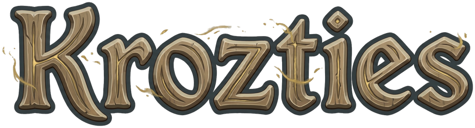

Krozties calcule, pour un personnage et son équipement, la rotation de sorts
qui fait le plus de dégâts sur plusieurs tours dans Dofus 3. Ses outils
(KrozTools) couvrent aussi les zones, les réseaux de pièges du Sram, les
bombes du Roublard, les portails de l'Eliotrope et la ligne de vue.

Données du jeu : version 3.7.

## État

En développement : aucune version n'est encore publiée.

## Mises à jour

L'application de bureau demande à GitHub, au plus une fois par jour, si une
nouvelle version est publiée, et l'annonce en bas à droite de la fenêtre.

## Installation

Les instructions par système (macOS, Windows, Linux), avec WinGet et Homebrew,
arrivent avec la première version.

## Licence

Le code de Krozties est publié sous licence AGPL-3.0 (fichier `LICENSE`).
Les données et visuels du jeu n'en font pas partie.

## Mentions

Certaines illustrations et éléments visuels sont la propriété d'Ankama Studio
et de Dofus. Cet outil est un outil communautaire non officiel, sans
affiliation avec Ankama.
